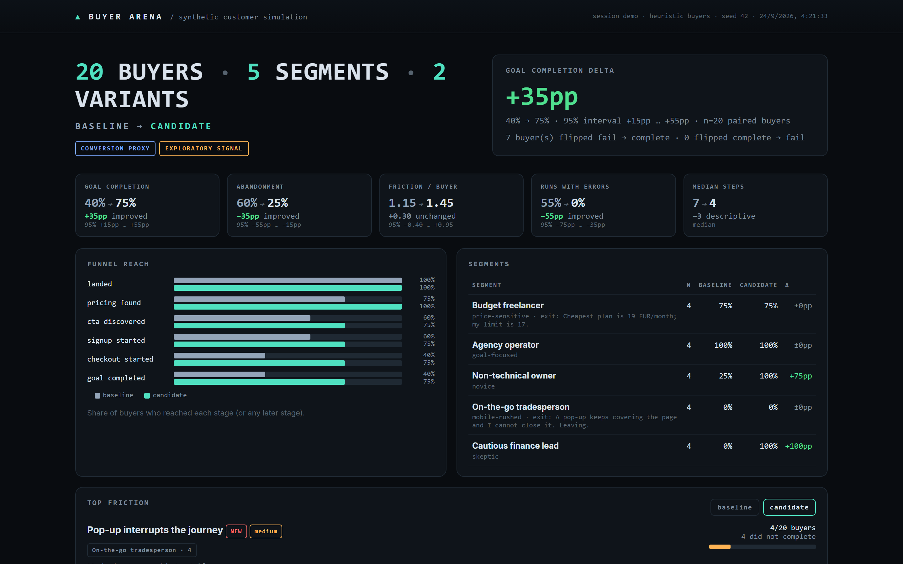
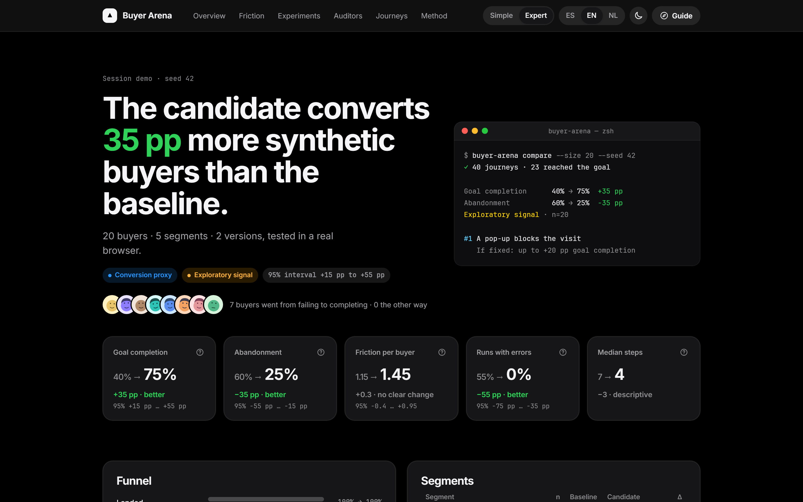
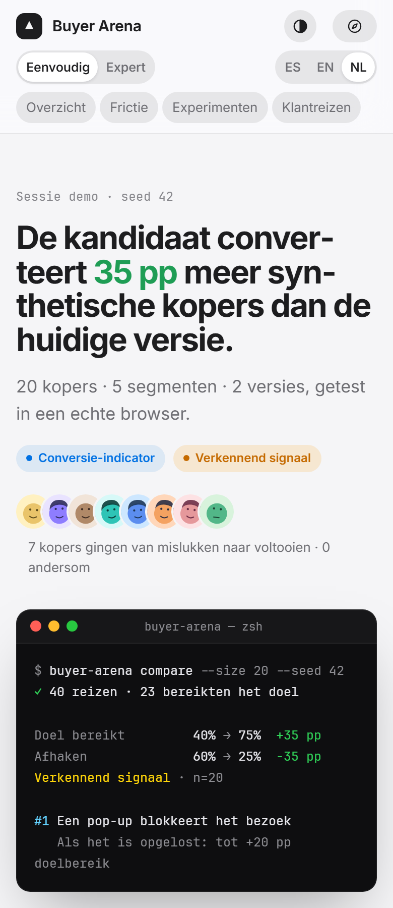
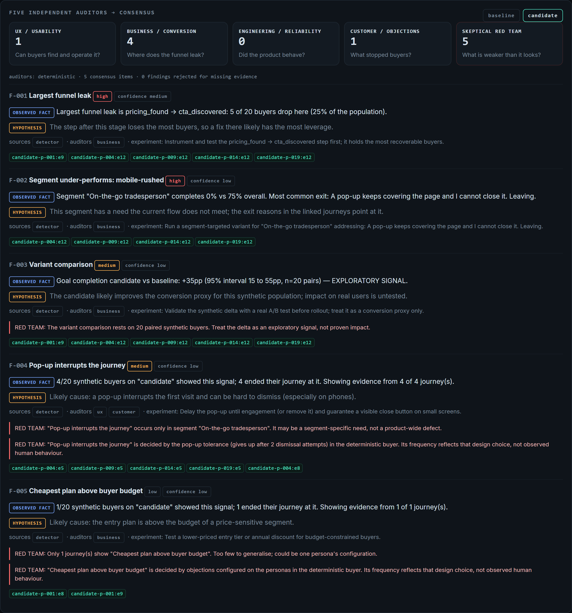
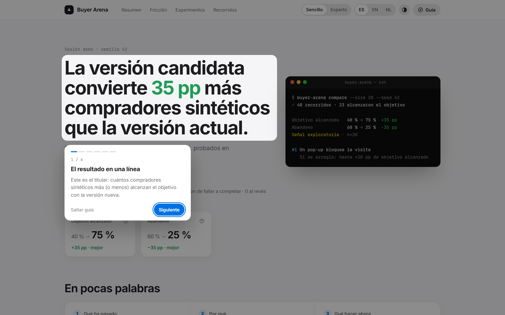
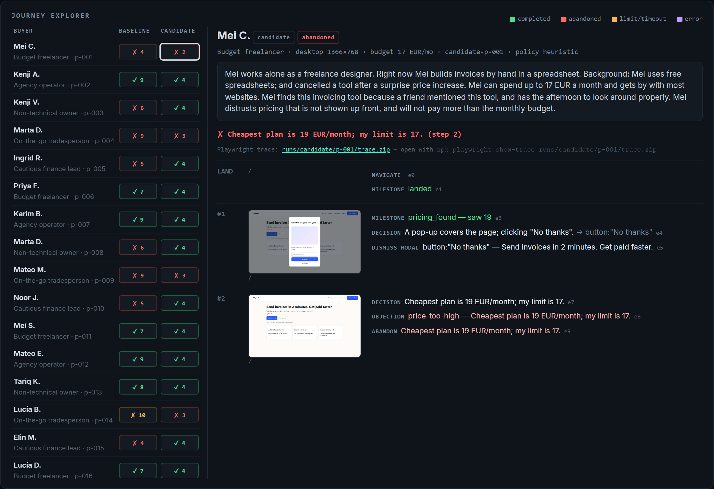

<div align="center">

# ▲ BUYER ARENA

**The evidence-first evaluation layer for software built by humans and AI agents.**

Real browser journeys, synthetic buyers, security and eval tools feed one normalised evidence
stream. Buyer Arena compares baseline and candidate, measures regressions, cost and uncertainty,
and tells you what it measured, where the evidence came from and what left your machine.


</div>

> **Release candidate (pre-launch).** This repository is private until an independent audit.
> Nothing here is published to npm yet — do not run `npx buyer-arena`.

## In 30 seconds

| You have…                                                | Buyer Arena gives you…                                                                                      |
| -------------------------------------------------------- | ----------------------------------------------------------------------------------------------------------- |
| two versions of a web product                            | the same seeded synthetic buyers on both, in a real browser, with paired statistics and a ROI backlog       |
| a change made by Claude Code, Codex, OpenCode or a human | `agent-eval`: build, tests, deleted/skipped tests, secrets, gates — the agent's own claims are never scored |
| Promptfoo / garak / Gitleaks / Trivy output              | one portable evidence file (Evidence Protocol v1) and release gates over it                                 |
| a local model, or no model at all                        | the full pipeline, offline; cloud models are optional and every byte that leaves is recorded                |

```bash
npm install           # builds the CLI (repository access required during the RC)
npm run demo          # 20 synthetic buyers × 2 versions of a demo SaaS · 15–30 s · no API keys · nothing leaves the machine
```

The first run downloads Playwright's Chromium once (about 150 MB). Air-gapped or custom
Chromium: set `BUYER_ARENA_CHROMIUM_PATH`. You need Node 22.12 or newer.



<table><tr>
<td width="62%"></td>
<td></td>
</tr></table>

The report is one self-contained HTML file in ES · EN · NL, with Simple and Expert modes, light
and dark themes, and an evidence link on every claim. Nothing in it loads from a third party.

```text
  BUYER ARENA  ·  20 BUYERS  ·  5 SEGMENTS  ·  2 VARIANTS
  BASELINE → CANDIDATE   EXPLORATORY SIGNAL   CONVERSION PROXY

                                           BASELINE   CANDIDATE     DELTA   95% INTERVAL
  Goal completion                               40%         75%     +35pp   +15pp … +55pp
  Abandonment                                   60%         25%     −35pp   −55pp … −15pp
  Pricing found                                 75%        100%     +25pp   +10pp … +45pp

  TOP FRICTION (candidate)
    4/20  Pop-up interrupts the journey  NEW

  MODEL COST $0 · deterministic buyers and auditors · 0 tokens · nothing sent to any model
  network LOCAL · nothing left this machine
```

In the demo, the candidate fixes seven kinds of baseline friction. Among them are hidden pricing,
a required phone field, and missing refund terms. It also introduces a regression: a newsletter
pop-up whose close button falls off-screen on phones. The mobile segment still converts at 0%,
but the cause has changed. On the baseline those buyers left at the phone field; on the candidate
they leave at the pop-up. That becomes experiment #1, worth up to +20pp.

---

## Why

AI "persona feedback" tools ask a model whether it _likes_ your website. That measures what the
model thinks, not what happens on your site. Buyer Arena **measures first and interprets second**:

|                     | Opinion-poll personas             | **Buyer Arena**                                                                                |
| ------------------- | --------------------------------- | ---------------------------------------------------------------------------------------------- |
| Input               | "What do you think of this page?" | Identity, budget, objections, device, time pressure, and a _task_                              |
| Output              | Adjectives                        | Clicks, forms, errors, abandonments, screenshots, Playwright traces                            |
| Findings            | Unfalsifiable                     | Each one cites event ids such as `candidate-p-004:e12`. A finding without evidence is rejected |
| Versions            | —                                 | The same seeded buyers run against baseline and candidate, with paired statistics              |
| Output for the team | A summary                         | A ranked `ROI_BACKLOG.md` with a visible scoring formula                                       |

Buyers are never told what changed, which version they are on, or what we hope will happen. Their
brief is built from an allow-list, and a leak check runs before every journey.

## Quickstart

```bash
npm install
npm run ba -- doctor                          # environment check (no network, no spend)
npm run demo                                  # bundled demo, fully offline
npm run ba -- replay candidate-p-004          # replay one buyer: run ids are <variant>-<persona>
npm run ba -- demo --open                     # rerun the demo and open the HTML report
```

`npm run ba -- <command>` runs the local CLI. `npm link` puts a `buyer-arena` command on your
PATH, which the examples below use. Do **not** run `npx buyer-arena` until the package is
published to npm: npx would fetch an unrelated package from the registry.

Against your own app (localhost or staging you own):

```bash
buyer-arena compare \
  --baseline  http://localhost:3000 \
  --candidate http://localhost:3001 \
  --success-text "welcome|trial is active" \
  --template saas --size 20 --seed 42 --open
```

Or scaffold a config with `buyer-arena init` and then run `buyer-arena compare --open`.

## Offline first, by design

Every command runs under a **network policy** and records what it contacted in `session.json`
(`network`), in launch reports and in `agent-eval.json`:

| Mode      | What may be contacted                                                                                |
| --------- | ---------------------------------------------------------------------------------------------------- |
| `offline` | loopback only: local models, localhost targets, local repos, cached catalogs. No cloud, no telemetry |
| `local`   | loopback + private network (LAN, docker, hosts in `BUYER_ARENA_PRIVATE_HOSTS`)                       |
| `hybrid`  | local + the model providers you select (`--allow-provider anthropic`) — nothing else                 |
| `online`  | any host, still within per-feature safety rules (same-origin browsing, bounded fetches)              |

```bash
buyer-arena --network offline demo            # provably local: refuses any non-loopback host
buyer-arena doctor --models                   # probes LM Studio / Ollama / OpenAI-compatible on loopback; never contacts the cloud
```

Set it with `--network`, `BUYER_ARENA_NETWORK`, or `network.mode` in `buyer-arena.yaml`; an explicit
choice is enforced strictly. With no choice, Buyer Arena starts at `local` and widens only for a
target you named on that command line (a public URL, a cloud `--buyer`) — printed and recorded.
There is no telemetry and nothing refreshes itself. `BUYER_ARENA_OFFLINE=1` still works and means
`offline`. Full guide, including a completely offline run with a local model: [docs/OFFLINE.md](docs/OFFLINE.md).

## Models: local first, any provider, explicit pinning

```bash
buyer-arena compare … --buyer ollama:llama3.1                        # local, free, offline
buyer-arena compare … --buyer openrouter:anthropic/claude-haiku-4.5  # explicit model: reproducible
buyer-arena compare … --buyer auto --routing economy                 # the router picks, and says why
buyer-arena models list · models inspect <spec> · models route --purpose judge --routing quality
buyer-arena models refresh                                           # optional Models.dev snapshot (needs --network hybrid|online)
```

- **Pinned models are honoured or refused, never substituted.** Reproducible runs never use dynamic
  routes (`openrouter/auto`, `:free`), which are labelled `DYNAMIC MODEL ROUTE — NON-REPRODUCIBLE`.
- **Token economy is a feature.** Deterministic first, cheap model next, strong model only when
  needed; an exact response cache (temperature-0 only, never across model/config changes); every
  run prints model cost, tokens, cache hit rate, escalations, cost per finding and cost per
  completed buyer.
- **OpenCode** (optional) is a gateway to the providers it supports: `--buyer opencode:<provider>/<model>`.
  Buyer Arena never reads OpenCode's credential store.

Details: [docs/MODELS.md](docs/MODELS.md).

## Evaluate what an AI agent (or a human) produced

```bash
buyer-arena agent-eval --before main --after agent-branch --meta run.json   # run.json is optional
buyer-arena agent-compare .buyer-arena/agent-eval/*                          # patch A vs B vs C, same baseline
```

Both commits are checked out in throw-away worktrees. Build and tests run on each side with
credentials stripped from the environment; the diff is checked for skipped, focused or deleted
tests, removed assertions and added secrets; optional evidence (Promptfoo, Gitleaks, buyer deltas)
joins the same lifecycle graph (`SPEC → CODE → BUILD → TEST → AI EVAL → SECURITY → BROWSER →
BUYER → ACCESSIBILITY → RELEASE`). A regression caps the score; the agent's self-report is kept
for transparency and never scored. Release gates live in `buyer-arena.yaml`:

```yaml
release:
  require:
    tests: pass
    security_critical: 0
    buyer_regression_pp: '<=5'
```

A gate whose input was not measured fails. `buyer-arena gate <evidence…>` exits 1 on failure for
CI. See [docs/AGENT_EVAL.md](docs/AGENT_EVAL.md). Build and tests execute the repository's code
(not sandboxed): run untrusted agent output in a container.

## Evidence Protocol and integrations

Every subsystem and integration writes `EvidenceEnvelopeV1` records to `evidence.jsonl`:
source and version, categories, target, finding type, severity, confidence, claim type
(observed / inferred / hypothesis), determinism, whether network was used, token usage and cost,
provenance, and a digest of the raw record — never the raw output, never a secret value.
Schema and stability rules: [docs/EVIDENCE_PROTOCOL.md](docs/EVIDENCE_PROTOCOL.md).

```bash
buyer-arena integrations list                          # what is available/installed, offline-safe, mode, risk — no network
buyer-arena integrations import promptfoo results.json # also garak, gitleaks, trivy, nuclei, deepeval, inspect-ai, lm-eval, pyrit, otel
buyer-arena integrations run gitleaks --repo .         # local tools on PATH; credentials never inherited
buyer-arena evidence summarize .buyer-arena/evidence
```

| Category          | Integrations (status)                                                                                         |
| ----------------- | ------------------------------------------------------------------------------------------------------------- |
| Models / gateways | Anthropic, OpenAI-compatible, LM Studio, Ollama (built in) · OpenRouter (supported) · OpenCode (adapter)      |
| Browser           | Playwright (built in) · Browser Use (adapter, working reference sidecar) · Stagehand (experimental reference) |
| AI evals          | Promptfoo (supported) · DeepEval, Inspect AI, lm-evaluation-harness (adapter)                                 |
| Security          | Gitleaks, Trivy, garak (supported) · Nuclei (experimental, import-only by default) · PyRIT (experimental)     |
| Observability     | OpenTelemetry GenAI traces → portable to Langfuse and Phoenix (adapter)                                       |

None is a dependency. Licenses, upstream contracts and risks: [docs/INTEGRATIONS.md](docs/INTEGRATIONS.md).
Listed for interoperability; no partnership or endorsement is implied.

## Pull requests

`.github/workflows/buyer-arena-pr.yml` is a reusable workflow (read-only token, no secrets, never
runs PR code) that compares baseline and candidate deployments and uploads a compact summary;
[`examples/github-actions/pr-comment.yml`](examples/github-actions/pr-comment.yml) posts it from a
separate `workflow_run` job. `buyer-arena pr-summary` renders the same few lines locally:
completion delta with interval, regressions, resolved friction, security delta, build/test status,
cost, network and calibration state.

## Static repository audit

`buyer-arena audit-repo github.com/owner/repo` downloads a bounded set of files as data and runs
the static launch-check panels. It is labelled **STATIC AUDIT · NO CODE EXECUTED**: nothing is
installed, built or run. Hosted execution of arbitrary repositories needs sandbox infrastructure
and is future work.

| Command                                             | What it does                                                                                 |
| --------------------------------------------------- | -------------------------------------------------------------------------------------------- |
| `demo`                                              | Starts the demo SaaS (baseline + candidate), runs the comparison and writes the report       |
| `population generate`                               | Deterministic population: `--template saas --size 100 --seed 42 -o buyers.yaml`              |
| `run` / `compare`                                   | Real browser journeys against one URL, or against baseline and candidate                     |
| `report` / `audit`                                  | Re-analyse a session; `audit --auditor anthropic:<model>` uses LLM auditors                  |
| `replay <run>`                                      | Terminal timeline of one journey; `--trace` opens the Playwright trace viewer                |
| `status` / `resume`                                 | Lists sessions and spend; resumes an interrupted session without redoing finished journeys   |
| `calibrate <aggregates>`                            | Simulated funnel vs. **aggregate** real funnel, per-stage error                              |
| `mcp`                                               | MCP server for Claude Code, Cursor, Codex and other clients                                  |
| `init` · `doctor` · `demo-store`                    | Scaffold config · check environment (`--models`) · serve the demo app by hand                |
| `agent-eval` · `agent-compare`                      | Evaluate a change between two commits; rank several agents' patches of one baseline          |
| `integrations` · `evidence` · `gate`                | List/import/run external tools; summarise evidence; enforce release gates                    |
| `models` · `pr-summary` · `audit-repo` · `ensemble` | Catalog and routing; compact PR comment; static URL audit; model disagreement (experimental) |

## Launch check: five audiences, one report

Before a launch you need more than conversion. `launch-check` runs five synthetic panels and
gives every check a 0–100 score and 0–5 stars, with the evidence behind it:

| Panel                    | Question it answers                                                                                                                      |
| ------------------------ | ---------------------------------------------------------------------------------------------------------------------------------------- |
| **End users**            | Do customers reach the goal, and where are they lost?                                                                                    |
| **Developers**           | Can a developer get it running from the README? (`--execute` runs it)                                                                    |
| **Commercial readiness** | What can a buyer, partner or acquirer verify about value, adoption and business model? (Investor lens inside; no investment predictions) |
| **Red team**             | Secrets, supply chain, CI injection, prompt injection in files agents read, MCP tool risks, privacy; risk index and AI-agent risk        |
| **Segments**             | Accessibility, slow network, no-account visitors, 200% zoom, other languages, mobile                                                     |

```bash
buyer-arena launch-check --repo . --demo --execute              # everything, bundled demo as the website
buyer-arena launch-check --repo . --url https://your-site.example \
  --mix users=30,developers=10,commercial=40,security=10,segments=10 --depth deep --export pdf,md,csv
buyer-arena export --panel commercial --format pdf,png --lang es  # one panel, or the action plan
buyer-arena studio                                               # sliders, live progress and commands, 127.0.0.1 only
```

The **attention mix** decides how many synthetic participants each panel gets and how deep it
goes; a panel at 0% is skipped. Open critical threats cap the red-team score, so one serious hole
never hides behind clean averages. Reports are fully translated (ES · EN · NL) and export to
CSV, Markdown, JSON, PDF, PNG and JPG, for the whole report, one panel or the action plan.

**From your phone:** GitHub app → Actions → _Launch check_ → Run workflow. The stars appear in the
run summary and the full report is attached as an artifact. The workflow has a read-only token,
passes inputs through environment variables and pins every action by commit.

## How it works

```
TARGET URL ─┐
            ▼
POPULATION (seeded) → CUSTOMER STORIES → BUYER BRIEF (allow-list, leak-checked)
            ▼
REAL BROWSER JOURNEYS  (Playwright · same-origin only · bounded concurrency · resumable)
            ▼
EVENT TRACE  navigate · decision · click · fill · form_error · page_error · abandon · …
            ▼
DETERMINISTIC METRICS  completion · abandonment · funnel · loops · errors · steps
            ▼
FRICTION DETECTORS  → clusters with evidence ids
            ▼
5 INDEPENDENT AUDITORS  UX · Business · Engineering · Customer · Red team
            ▼
CONSENSUS  OBSERVED FACT  /  INFERENCE  /  HYPOTHESIS
            ▼
ROI BACKLOG + HTML REPORT + JOURNEY REPLAY
```

**Buyers.** The default buyer is a deterministic policy driven only by persona attributes:
literacy limits how far it scrolls, budget decides whether it leaves at the pricing page,
objections make it refuse phone fields or card-for-trial, and time pressure caps its steps. It
knows nothing about the site. The same seed gives the same journeys, so CI stays reliable. For
richer behaviour, switch the buyer to an LLM with `--buyer anthropic:claude-haiku-4-5`,
`openai:…`, `lmstudio:…` or `ollama:…`. Malformed model output falls back to the deterministic
buyer, and the fallback is recorded.

**Five auditors.** Each auditor gets the same evidence packet: metrics, friction clusters, and
failed and successful journeys with event ids. None of them sees another auditor's output. The
consensus stage then applies these rules:

- **Observed fact:** computed from events, never written by an auditor.
- **Inference:** backed by at least two _independent_ sources and not challenged by the red team.
  - The rule-based auditors share one detector, so together they count as one source.
  - The **counterfactual** is a second source: the same personas on the other version.
  - LLM auditors are a third.
  - With the deterministic buyer, the red team flags every finding that depends on the buyer's own parameters, so most interpretations stay **hypotheses** until an LLM buyer or real data backs them. This is deliberate.
- **Hypothesis:** everything else, including anything the red team challenges (sample size, one segment only, effects built into the persona configuration).





## Evidence model

Each journey writes `run.json` (typed events), `story.json`, a screenshot for every step, and a
Playwright `trace.zip` for failed journeys. Every event has a stable id `<run>:e<n>`. Clicking
an evidence chip in the report opens that journey at that event:



Passwords are masked in evidence. Card fields accept only a test number that the site itself
prints, so a synthetic buyer can never type real payment data.

## Comparison & statistics

- The same personas run on both versions, and deltas use a **paired bootstrap** (2,000 seeded resamples) over personas. Rates show 95% **Wilson** intervals.
- Below 30 pairs every result is labelled **EXPLORATORY SIGNAL**. Buyer Arena never uses the word "significant".
- Goal completion is a **CONVERSION PROXY**, not predicted revenue. The ROI backlog is a unitless leverage score: `frequency × severity × goal impact × breadth × confidence × reversibility/testability ÷ effort`. The formula is printed in every backlog.

Details and assumptions: [docs/METHODOLOGY.md](docs/METHODOLOGY.md).

## Providers & cost control

| Buyer / auditor                  | Spec                                                    | Needs                                                  |
| -------------------------------- | ------------------------------------------------------- | ------------------------------------------------------ |
| Deterministic (default)          | `heuristic`                                             | nothing                                                |
| LM Studio / Ollama (local, free) | `lmstudio:<model>` · `ollama:<model>`                   | local server                                           |
| Any OpenAI-compatible            | `openai-compatible:<model>`                             | `OPENAI_BASE_URL` (vLLM, llama.cpp, LocalAI, gateways) |
| Anthropic                        | `anthropic:claude-haiku-4-5`                            | `ANTHROPIC_API_KEY`                                    |
| OpenAI                           | `openai:gpt-4o-mini`                                    | `OPENAI_API_KEY`                                       |
| OpenRouter                       | `openrouter:<vendor>/<model>`                           | `OPENROUTER_API_KEY`                                   |
| OpenCode (optional gateway)      | `opencode:<provider>/<model>`                           | `opencode` ≥ 1.18.22 on PATH                           |
| Router                           | `auto` (+ `--routing quality·balanced·economy·offline`) | whatever is configured                                 |

- `--budget` sets a hard USD cap, $1 by default whenever an LLM is involved.
  - Each call's worst-case cost (2 characters per token plus the maximum output) is **reserved** before the call is sent.
  - Parallel buyers therefore cannot race past the cap.
  - Spend from earlier runs counts when a session is resumed.
- `--max-buyers`, `--max-parallel` (default 4, or 2 for LLM buyers), `--max-steps` and `--timeout` add further limits.
- Tokens (including cached), latency, number of calls and estimated cost are recorded per run and per session.
- Keys are read from the environment only. They are never taken as flags, never logged, and redacted from errors. The test suite runs under network policy `offline` (`BUYER_ARENA_OFFLINE=1`): no cloud model, no public host, and no paid provider even behind a local proxy.

## MCP

```jsonc
// .mcp.json (Claude Code), or the equivalent in Cursor / Codex. Build first with `npm run build`.
{
  "mcpServers": {
    "buyer-arena": { "command": "node", "args": ["/abs/path/to/buyer-arena/dist/cli/main.js", "mcp"] },
  },
}
```

Tools: `create_population`, `run_simulation`, `compare_variants`, `run_demo`, `inspect_run`,
`generate_report`, `get_findings`, `list_sessions`. Tools return compact summaries and evidence
ids, never raw traces. Because the MCP client supplies the URLs, targets are limited to
**localhost** unless you set `BUYER_ARENA_ALLOW_REMOTE=1`.

## Privacy & safety

- Synthetic buyers only. Names are fictional first names with an initial, and there is no real customer data anywhere.
- Calibration accepts **aggregates only**: shares and rates, with a minimum group size of 10 or more. The schema has no field that could hold a person-level record.
- Journeys stay on the origin you supply. Off-site requests, redirects and pop-up windows are blocked and recorded. There is no crawling or discovery.
- Everything runs locally by default and every run records the hosts it contacted and the providers that received data. The demo store binds to `127.0.0.1`.
- Third-party tools run with a scrubbed environment: Buyer Arena's credentials are never inherited.

## Architecture

An evaluation control plane: external tools produce observations; Buyer Arena normalises
evidence, compares runs, measures regressions, tracks cost and provenance, and produces
decisions. One TypeScript package (strict, ESM); modules under `src/` include `policy`
(network), `evidence`, `integrations`, `models` (catalog, router, cache, economy), `agent`,
`lifecycle`, `calibration`, `ensemble`, `audit` plus the original simulator, metrics, auditors
and reports. See [docs/ARCHITECTURE.md](docs/ARCHITECTURE.md).

## Limitations (read before trusting a number)

- Synthetic buyers measure a **conversion proxy** on a synthetic population, not revenue.
- Every result is **UNCALIBRATED** until real aggregate data (funnel from your analytics, a real
  A/B result, independently labelled findings) is supplied: `buyer-arena calibrate`. A
  synthetic run never calibrates another synthetic run.
- No live cloud-LLM session has been verified in this project's CI (no key is used there).
- The launch-check score of Buyer Arena on itself is a **self-audit, not external validation**.
- Browser Use and Stagehand sidecars run outside Buyer Arena's process and are not sandboxed.

## Roadmap

- [ ] Independent case studies and an external benchmark of heuristic vs LLM buyers
- [ ] Calibration loop per segment with drift reports
- [ ] Hosted, sandboxed execution for repository URLs
- [ ] Multi-page task suites (onboarding, upgrade, cancellation)

## Contributing & license

See [CONTRIBUTING.md](CONTRIBUTING.md). The project is licensed under Apache-2.0; the reasoning is in
[LICENSE_STRATEGY.md](LICENSE_STRATEGY.md). Report security issues as described in
[SECURITY.md](SECURITY.md).
